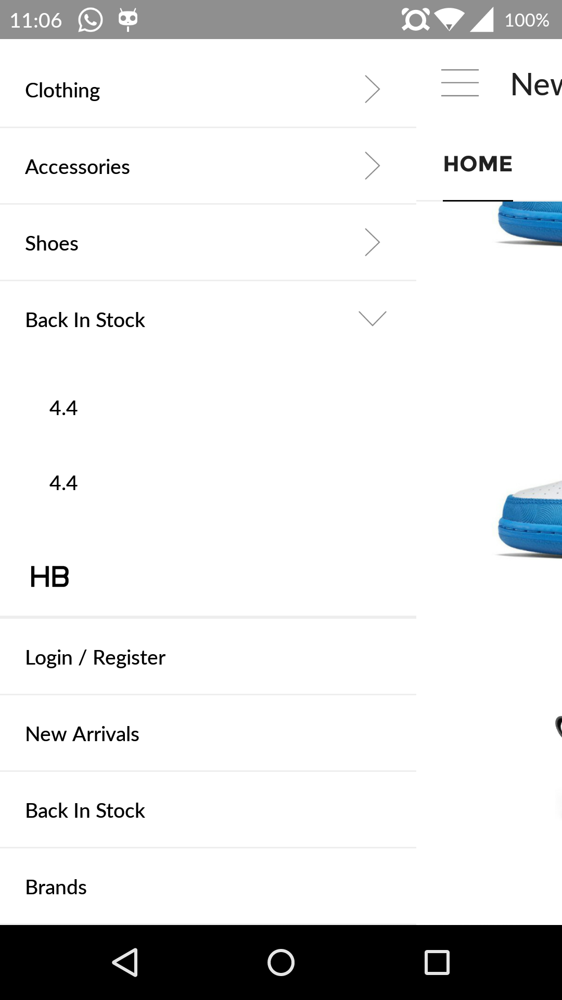

# BringItBackAdvanceSlidingMenu 

[][23] [][24]
[](http://android-arsenal.com/details/1/2099)[](http://www.android-gems.com/lib/jjhesk/BringItBackAdvanceSlidingMenu)

Master: [][22]

BranchV1: [][22]

I am bringing it back from the good old project sliding menu in the Android Studio. It will be an alternative to the google promoted Drawer Layout. With tons of additional tools and precoded frameworks you can work on the things you want from the scatch. 

##Features
- [x] slide in and slide out options
- [x] building external fragment swapping support for both v4 and v13
- [x] precoded fragment support templates
- [x] precoded fragment menu
- [x] precoded treeview fragment menu
- [x] profile view menu
- [x] fully slacky support menu layout implementations and customizations
- [x] newsfeed abstract for instance implementation
- [x] catelog abstract for showing grid views of items
- [x] simple tree list for expandable list item view - allows many customizations
- [x] menu banners on the list recycler view - allows many customizations

###v1.6.4
- [x] add screen control that it will able to block the screen and its touch interactions

###v1.6.3
- [x] fixed lilpop 5.0 issue
- [x] full screen and transparent nagivation and status bar configurations
- [x] building blocks ready for easy fast implementation

###v1.6.0
- [x] newsfeed abstract for instance implementation
- [x] catelog abstract for showing grid views of items
- [x] simple tree list for expandable list item view - allows many customizations
- [x] menu banners on the list recycler view - allows many customizations

###v1.5.5
- [x] precoded treeview fragment menu

###v1.5.2
- [x] slide in and slide out options
- [x] building external fragment swapping support for both v4 and v13
- [x] precoded fragment support templates
- [x] precoded fragment menu
- [x] profile view menu
- [x] fully slacky support menu layout implementations and customizations

##Coding support
Please visit out wiki page for more [tutorial informations][28]

Supporting methods availabilities

| methods | explainations|
| :---- | :---- |
| mode| left or right |
| viewAbove| layout reference |
| viewBehind| layout reference |
| behindOffset| dimension |
| behindWidth| dimension |
| behindScrollScale| float |
| touchModeAbove| margin or fullscreen or none|
| touchModeBehind| margin or fullscreen or none|
| shadowDrawable| the reference of the drawable of the fading shadow|
| shadowWidth| the dimension of the width of menu|
| fadeEnabled| enable for fading on the menu|
| fadeDegree| enable the fading darkenness for the menu|
| selectorEnabled| 2 |
| selectorDrawable| 1|
| contentFadeEnabled| enable for the content fade|
| contentFadeDegree| the fading degree for the content|

###ScreenShots
[](http://www.android-gems.com/lib/jjhesk/BringItBackAdvanceSlidingMenu)



![Example application looks on phone][29]
![Example application looks on phone][31]
![Example application looks on tablet][30]


## Installations
Please check with supported repo mavens

###jitpack remote
[][23]
```gradle
repositories { maven {  url "https://jitpack.io"  }}
dependencies { compile 'com.github.jjhesk:BringItBackAdvanceSlidingMenu:vX.XX'}
```
###Bintray Remote 
[][23]
```gradle
repositories { maven {  url "http://dl.bintray.com/jjhesk/maven"  }}
dependencies { compile 'com.hkm.slidingmenulib:slidingmenulib:x.x.x'}
```
Please see the version number.

###Thanks
* Use sliding menu from  [SlidingMenu][26]
* Use embeded advanced recyclerview from [UltimateRecyclerView][25]
* Use Picasso Image library from [Picasso][27]


## Apps whom use this lib also adapted from this technology
* [Foursquare][15]
* [LinkedIn][19]
* [Zappos][20]
* [Rdio][8]
* [Evernote Food][18]
* [Plume][4]
* [VLC for Android][5]
* [ESPN ScoreCenter][14]
* [MLS MatchDay][16]
* [9GAG][17]
* [Wunderlist 2][13]
* [The Verge][6]
* [MTG Familiar][9]
* [Mantano Reader][10]
* [Falcon Pro (BETA)][12]
* [MW3 Barracks][11]
License
--------

    Copyright 2015 Heskeyo Kam JJhesk

    Licensed under the Apache License, Version 2.0 (the "License");
    you may not use this file except in compliance with the License.
    You may obtain a copy of the License at

       http://www.apache.org/licenses/LICENSE-2.0

    Unless required by applicable law or agreed to in writing, software
    distributed under the License is distributed on an "AS IS" BASIS,
    WITHOUT WARRANTIES OR CONDITIONS OF ANY KIND, either express or implied.
    See the License for the specific language governing permissions and
    limitations under the License.


[1]: http://twitter.com/slidingmenu
[2]: http://actionbarsherlock.com/
[3]: https://play.google.com/store/apps/details?id=com.zappos.android&hl=en
[4]: https://play.google.com/store/apps/details?id=com.levelup.touiteur&hl=en
[5]: https://play.google.com/store/apps/details?id=org.videolan.vlc.betav7neon
[6]: https://play.google.com/store/apps/details?id=com.verge.android
[7]: http://bit.ly/TWejze
[8]: https://play.google.com/store/apps/details?id=com.rdio.android.ui
[9]: https://play.google.com/store/apps/details?id=com.gelakinetic.mtgfam
[10]: https://play.google.com/store/apps/details?id=com.mantano.reader.android
[11]: https://play.google.com/store/apps/details?id=com.phonegap.MW3BarracksFree
[12]: http://forum.xda-developers.com/showthread.php?p=34361296
[13]: http://bit.ly/xs1sMN
[14]: https://play.google.com/store/apps/details?id=com.espn.score_center
[15]: https://play.google.com/store/apps/details?id=com.joelapenna.foursquared
[16]: https://play.google.com/store/apps/details?id=com.mlssoccer
[17]: https://play.google.com/store/apps/details?id=com.ninegag.android.app
[18]: https://play.google.com/store/apps/details?id=com.evernote.food
[19]: https://play.google.com/store/apps/details?id=com.linkedin.android
[20]: https://play.google.com/store/apps/details?id=com.zappos.android
[21]: https://bintray.com/jjhesk/maven/slidingmenulib/_latestVersion
[22]: https://travis-ci.org/jjhesk/BringItBackAdvanceSlidingMenu
[23]: https://bintray.com/jjhesk/maven/slidingmenulib/_latestVersion
[24]: https://www.apache.org/licenses/LICENSE-2.0
[25]: https://github.com/cymcsg/UltimateRecyclerView
[26]: https://github.com/jfeinstein10/SlidingMenu
[27]: https://github.com/square/picasso
[28]: https://github.com/jjhesk/BringItBackAdvanceSlidingMenu/wiki
[29]: https://lh5.ggpht.com/jDdm1FbB13aXq11J61__URorAlT-h12kvU0VlaaDdL1PF5wNrUOVJmdKMqlz506hIg
[30]: https://lh6.ggpht.com/yYy24DPwltmo1Xp0SPAyWzpKOIF7azoTvlveH3X4XWkHo_xm0UQ1lcT-1NJl8QUWBCDA
[31]: https://lh4.ggpht.com/98rCqlg4r2aUJCFKZ-_-yTJpVd2OAN4SMzqpiDAvDX-IM0IDTXcvoPEKfQJWQM1IXUU-
